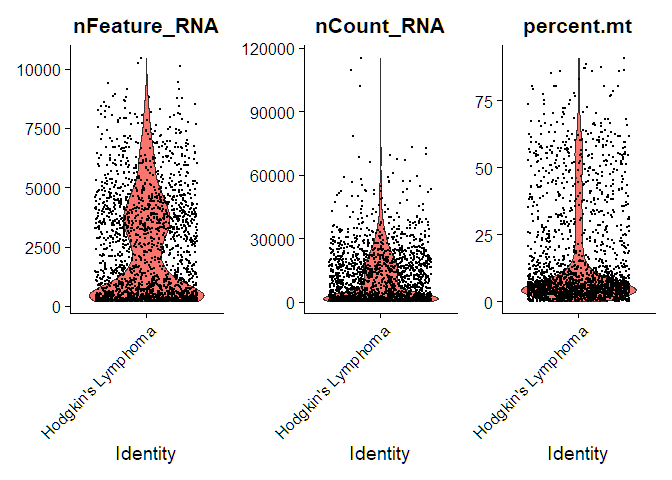
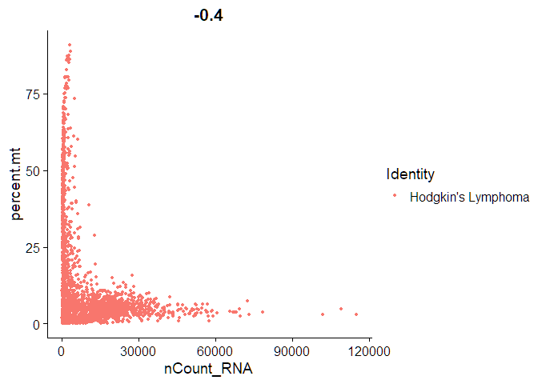
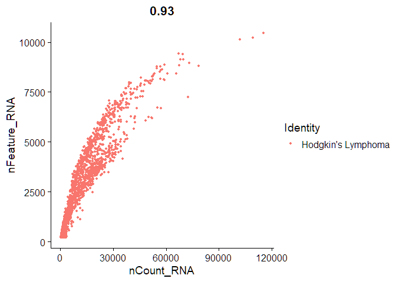
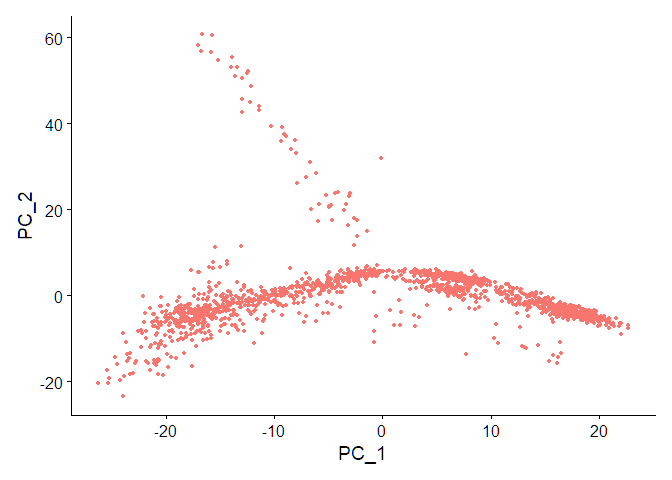
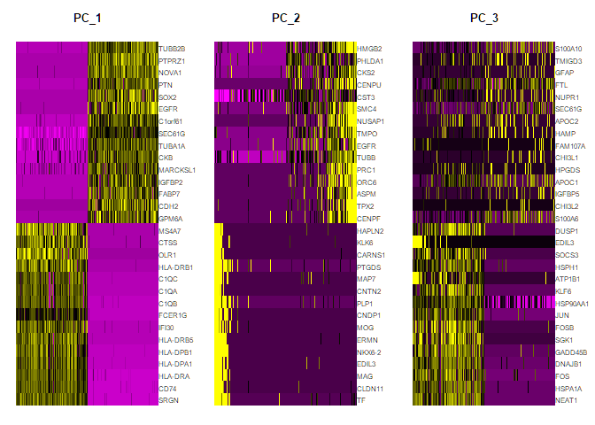
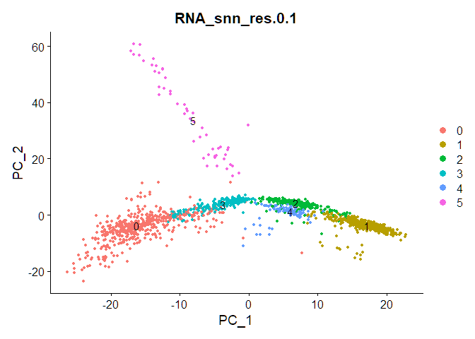

Single Cell RNA-Seq
================

Workflow conducting a single-cell RNA-Seq analysis in R using Seurat on
a 10x Genomics dataset containing sorted cells from human Glioblastoma
Multiforme, a fast-growing brain tumor.

``` r
library(rmarkdown)
```

    ## Warning: package 'rmarkdown' was built under R version 4.3.2

``` r
library(Seurat)
```

    ## Warning: package 'Seurat' was built under R version 4.3.2

    ## Loading required package: SeuratObject

    ## Warning: package 'SeuratObject' was built under R version 4.3.2

    ## Loading required package: sp

    ## Warning: package 'sp' was built under R version 4.3.2

    ## 
    ## Attaching package: 'SeuratObject'

    ## The following object is masked from 'package:base':
    ## 
    ##     intersect

``` r
library(tidyverse)
```

    ## Warning: package 'ggplot2' was built under R version 4.3.2

    ## Warning: package 'tidyr' was built under R version 4.3.2

    ## Warning: package 'readr' was built under R version 4.3.2

    ## Warning: package 'dplyr' was built under R version 4.3.2

    ## Warning: package 'stringr' was built under R version 4.3.2

    ## ── Attaching core tidyverse packages ──────────────────────── tidyverse 2.0.0 ──
    ## ✔ dplyr     1.1.4     ✔ readr     2.1.4
    ## ✔ forcats   1.0.0     ✔ stringr   1.5.1
    ## ✔ ggplot2   3.4.4     ✔ tibble    3.2.1
    ## ✔ lubridate 1.9.3     ✔ tidyr     1.3.0
    ## ✔ purrr     1.0.2

    ## ── Conflicts ────────────────────────────────────────── tidyverse_conflicts() ──
    ## ✖ dplyr::filter() masks stats::filter()
    ## ✖ dplyr::lag()    masks stats::lag()
    ## ℹ Use the conflicted package (<http://conflicted.r-lib.org/>) to force all conflicts to become errors

``` r
library(dplyr)
library(hdf5r)
```

    ## Warning: package 'hdf5r' was built under R version 4.3.2

    ## 
    ## Attaching package: 'hdf5r'
    ## 
    ## The following object is masked from 'package:purrr':
    ## 
    ##     flatten_df

Single-cell data was obtained from the 10x Genomics database
<https://www.10xgenomics.com/resources/datasets/2-k-sorted-cells-from-human-glioblastoma-multiforme-3-v-3-1-3-1-standard-6-0-0>

``` r
# Loading Hodgkin's Lymphoma tumor dataset
braintumor.data<- Read10X_h5(filename = 'D:/My Drive/Projects/R/Single-Cell RNA-Seq/data/Brain_Tumor_3p_raw_feature_bc_matrix.h5')

# Initialize the Seurat object with the raw (non-normalized data)
braintumor <- CreateSeuratObject(counts = braintumor.data, project = "Hodgkin's Lymphoma", min.cells = 3, min.features = 200)
braintumor
```

    ## An object of class Seurat 
    ## 21648 features across 2082 samples within 1 assay 
    ## Active assay: RNA (21648 features, 0 variable features)
    ##  1 layer present: counts

Typical QC controls for low-quality cells or empty droplets that often
have very few genes, cell doublets or multiplets that may exhibit an
aberrantly high gene count, and low-quality / dying cells often exhibit
extensive mitochondrial contamination

Mitochondrial QC metrics will be calculated with the
PercentageFeatureSet() function, which calculates the percentage of
counts originating from a set of features

``` r
#Mitochondrial QC metrics
braintumor[["percent.mt"]] <- PercentageFeatureSet(braintumor, pattern = "^MT-")
```

Creating visualizations of QC metrics to determine filter parameters

``` r
# Violin plot
VlnPlot(braintumor, features = c("nFeature_RNA", "nCount_RNA", "percent.mt"), ncol = 3)
```

    ## Warning: Default search for "data" layer in "RNA" assay yielded no results;
    ## utilizing "counts" layer instead.

<!-- -->

``` r
view(braintumor@meta.data)

# Scatter plot to visualize feature-feature relationships
plot1 <- FeatureScatter(braintumor, feature1 = "nCount_RNA", feature2 = "percent.mt")
plot2 <- FeatureScatter(braintumor, feature1 = "nCount_RNA", feature2 = "nFeature_RNA")
plot1
```

<!-- -->

``` r
plot2
```

<!-- -->

Based on the data from the plots above we can filter for unique feature
counts over 7500, unique feature counts less than 200, and \>20%
mitochondrial counts

``` r
braintumor <- subset(braintumor, subset = nFeature_RNA > 200 & nFeature_RNA < 7500 & percent.mt < 20)
```

``` r
# Normalizes the feature expression measurements for each cell by the total expression, multiplies this by a scale factor (10,000 by default), and log-transforms the result.
braintumor <- NormalizeData(braintumor)
```

    ## Normalizing layer: counts

Feature selection involves the calculation of features that exhibit high
cell-to-cell variation in the dataset, those that are highly expressed
in some cells, and lowly expressed in others by directly modeling the
mean-variance relationship inherent in single-cell data

``` r
# Identifying variable features
braintumor <- FindVariableFeatures(braintumor, selection.method = "vst", nfeatures = 2000)
```

    ## Finding variable features for layer counts

``` r
# Identify the 10 most highly variable genes
top10 <- head(VariableFeatures(braintumor), 10)

# plot variable features with and without labels
plot3 <- VariableFeaturePlot(braintumor)
plot4 <- LabelPoints(plot = plot3, points = top10, repel = T)
```

    ## When using repel, set xnudge and ynudge to 0 for optimal results

``` r
plot3
```

    ## Warning: Transformation introduced infinite values in continuous x-axis

<!-- -->

``` r
plot4
```

    ## Warning: Transformation introduced infinite values in continuous x-axis

<!-- -->

Scaling the data involves linear transformation which is a standard
pre-processing step prior to dimensional reduction techniques like PCA.
This shifts the expression of each gene so that the mean expression
across cells is 0 then scales the expression of each gene, so that the
variance across cells is 1. This step gives equal weight in downstream
analyses so that highly-expressed genes do not dominate

``` r
all.genes <- rownames(braintumor)
braintumor <- ScaleData(braintumor, features = all.genes)
```

    ## Centering and scaling data matrix

Principal component analysis (PCA) involves dimensionality reduction to
identify sources of heterogeneity in the dataset

``` r
braintumor <- RunPCA(braintumor, features = VariableFeatures(object = braintumor))
```

    ## PC_ 1 
    ## Positive:  SRGN, CD74, HLA-DRA, HLA-DPA1, HLA-DPB1, HLA-DRB5, IFI30, FCER1G, C1QB, C1QA 
    ##     C1QC, HLA-DRB1, OLR1, CTSS, MS4A7, CD83, PLEK, BCL2A1, SAT1, CTSZ 
    ##     ALOX5AP, FCGR3A, RGS1, CD14, FCGR2A, PLAUR, CTSB, APOC1, MS4A6A, PLIN2 
    ## Negative:  TUBB2B, PTPRZ1, NOVA1, PTN, SOX2, EGFR, C1orf61, SEC61G, TUBA1A, CKB 
    ##     MARCKSL1, IGFBP2, FABP7, CDH2, GPM6A, PMP2, BCAN, MAP2, GRIA2, SOX2-OT 
    ##     SCRG1, CHL1, METRN, SCG3, DSEL, FAM181B, SOX9, TRIM9, CNN3, ETV1 
    ## PC_ 2 
    ## Positive:  TF, CLDN11, MAG, EDIL3, NKX6-2, ERMN, MOG, CNDP1, PLP1, CNTN2 
    ##     MAP7, PTGDS, CARNS1, KLK6, HAPLN2, ANKS1B, EFHD1, SLC24A2, ENPP2, MYRF 
    ##     ABCA2, CAPN3, SPOCK3, TMEM144, PPP1R14A, GPR37, RAPGEF5, TMEM151A, KCNK1, UGT8 
    ## Negative:  HMGB2, PHLDA1, CKS2, CENPU, CST3, SMC4, NUSAP1, TMPO, EGFR, TUBB 
    ##     PRC1, ORC6, ASPM, TPX2, CENPF, JUN, CHL1, TOP2A, PTPRZ1, KNL1 
    ##     UBE2C, LMNB1, KIF23, KLF6, TRIB2, GTSE1, TYMS, CKAP2L, ZFP36, ATAD2 
    ## PC_ 3 
    ## Positive:  NEAT1, HSPA1A, FOS, DNAJB1, GADD45B, SGK1, FOSB, JUN, HSP90AA1, KLF6 
    ##     ATP1B1, HSPH1, SOCS3, EDIL3, DUSP1, EGR1, ANLN, HSPD1, KLF4, ZFP36 
    ##     NFKBIA, NR4A1, ATF3, MAP7, DOCK5, CLDN11, HSPA2, FNIP2, BTG2, CNTN2 
    ## Negative:  S100A10, TMIGD3, GFAP, FTL, NUPR1, SEC61G, APOC2, HAMP, FAM107A, CHI3L1 
    ##     HPGDS, APOC1, IGFBP5, CHI3L2, S100A6, S100A8, CD2, LINC01736, PLA2G2A, MT1X 
    ##     CD3E, TRBC2, S100A9, CD3D, GZMH, CD96, FXYD1, GZMA, GNLY, CST7 
    ## PC_ 4 
    ## Positive:  NUSAP1, TOP2A, UBE2C, UBE2T, TPX2, TTK, NUF2, BIRC5, MAD2L1, CENPF 
    ##     KIF23, KIF15, GTSE1, KNL1, DLGAP5, KIF14, TYMS, CENPM, CCNB2, RRM2 
    ##     MKI67, PBK, SGO1, CENPA, DEPDC1, CKAP2L, KIFC1, PRC1, PIMREG, MXD3 
    ## Negative:  ARHGAP29, COL4A1, COL18A1, COL4A2, MYO1B, IGFBP7, PDLIM1, GGT5, ITGA1, GNG11 
    ##     COBLL1, ADGRA2, COL1A2, FN1, PRSS23, CCN2, ADGRF5, COL3A1, BGN, TFPI 
    ##     CCDC3, PDGFRB, SPARCL1, EBF1, COL6A2, FOXC1, PRKG1, TBX3, EPAS1, CAVIN3 
    ## PC_ 5 
    ## Positive:  IL32, CRIP1, CD2, CCL5, TRBC2, GZMA, CD3E, CD3D, TUBA4A, ETS1 
    ##     NKG7, ITM2A, LCK, CST7, CD3G, LIME1, ITGA1, CD96, CD52, TRBC1 
    ##     IL2RG, TRAC, IKZF3, GZMH, CD247, CD8A, PRF1, CD8B, ISG20, SH2D1A 
    ## Negative:  CST3, FTL, APOE, FTH1, LGALS3, CTSL, PTPRZ1, FCGR2A, LPL, GLUL 
    ##     GRIA2, SOD2, FABP5, CTSB, VEGFA, NOVA1, CLU, NCAN, TRIM9, C1orf61 
    ##     AQP4, CHL1, PMP2, GPM6A, IFI30, ITGB8, ATP1B2, C5AR1, OLR1, LUZP2

``` r
# Checking if cells cluster in PCA
DimPlot(braintumor, reduction = "pca") + NoLegend()
```

<!-- -->

DimHeatmap allows for easy exploration of the primary sources of
heterogeneity in a dataset, and can be useful when trying to decide
which PCs to include for further downstream analyses

``` r
# Both cells and features are ordered according to their PCA scores
DimHeatmap(braintumor, dims = 1:3, cells = 500, balanced = T)
```

<!-- -->

To properly determine the dimensionality of the dataset an elbow plot
will be used to visualize the rankings of the principle components

``` r
# Elbow plot: a ranking of principle components based on the percentage of variance explained by each one 
ElbowPlot(braintumor)
```

<!-- -->

Clustering involves creating clusters of similar cells which have
similar feature expression patterns

``` r
braintumor <- FindNeighbors(braintumor, dims = 1:15)
```

    ## Computing nearest neighbor graph

    ## Computing SNN

``` r
braintumor <- FindClusters(braintumor, resolution = c(0.1,0.3, 0.5, 0.7, 1))
```

    ## Modularity Optimizer version 1.3.0 by Ludo Waltman and Nees Jan van Eck
    ## 
    ## Number of nodes: 1547
    ## Number of edges: 44370
    ## 
    ## Running Louvain algorithm...
    ## Maximum modularity in 10 random starts: 0.9658
    ## Number of communities: 6
    ## Elapsed time: 0 seconds
    ## Modularity Optimizer version 1.3.0 by Ludo Waltman and Nees Jan van Eck
    ## 
    ## Number of nodes: 1547
    ## Number of edges: 44370
    ## 
    ## Running Louvain algorithm...
    ## Maximum modularity in 10 random starts: 0.9295
    ## Number of communities: 9
    ## Elapsed time: 0 seconds
    ## Modularity Optimizer version 1.3.0 by Ludo Waltman and Nees Jan van Eck
    ## 
    ## Number of nodes: 1547
    ## Number of edges: 44370
    ## 
    ## Running Louvain algorithm...
    ## Maximum modularity in 10 random starts: 0.9037
    ## Number of communities: 12
    ## Elapsed time: 0 seconds
    ## Modularity Optimizer version 1.3.0 by Ludo Waltman and Nees Jan van Eck
    ## 
    ## Number of nodes: 1547
    ## Number of edges: 44370
    ## 
    ## Running Louvain algorithm...
    ## Maximum modularity in 10 random starts: 0.8831
    ## Number of communities: 12
    ## Elapsed time: 0 seconds
    ## Modularity Optimizer version 1.3.0 by Ludo Waltman and Nees Jan van Eck
    ## 
    ## Number of nodes: 1547
    ## Number of edges: 44370
    ## 
    ## Running Louvain algorithm...
    ## Maximum modularity in 10 random starts: 0.8528
    ## Number of communities: 13
    ## Elapsed time: 0 seconds

``` r
# Visualization
DimPlot(braintumor, group.by = "RNA_snn_res.0.1", label = T)
```

<!-- -->

``` r
# Setting identity of clusters
Idents(braintumor) <- "RNA_snn_res.0.1"
```

``` r
braintumor <- RunUMAP(braintumor, dims = 1:15)
```

    ## Warning: The default method for RunUMAP has changed from calling Python UMAP via reticulate to the R-native UWOT using the cosine metric
    ## To use Python UMAP via reticulate, set umap.method to 'umap-learn' and metric to 'correlation'
    ## This message will be shown once per session

    ## 05:47:51 UMAP embedding parameters a = 0.9922 b = 1.112

    ## 05:47:51 Read 1547 rows and found 15 numeric columns

    ## 05:47:51 Using Annoy for neighbor search, n_neighbors = 30

    ## 05:47:51 Building Annoy index with metric = cosine, n_trees = 50

    ## 0%   10   20   30   40   50   60   70   80   90   100%

    ## [----|----|----|----|----|----|----|----|----|----|

    ## **************************************************|
    ## 05:47:52 Writing NN index file to temp file C:\Users\Bengy\AppData\Local\Temp\Rtmpu8gF8g\file3dfc3fc135e
    ## 05:47:52 Searching Annoy index using 1 thread, search_k = 3000
    ## 05:47:52 Annoy recall = 100%
    ## 05:47:52 Commencing smooth kNN distance calibration using 1 thread with target n_neighbors = 30
    ## 05:47:53 Initializing from normalized Laplacian + noise (using RSpectra)
    ## 05:47:53 Commencing optimization for 500 epochs, with 57784 positive edges
    ## 05:47:56 Optimization finished

``` r
DimPlot(braintumor, reduction = "umap")
```

<!-- -->

Finding markers specific to each cluster

``` r
# Finding all markers distinguishing cluster 5 from clusters 0 and 3
cluster5.markers <- FindMarkers(braintumor, ident.1 = 5, ident.2 = c(0, 3))
```

    ## For a (much!) faster implementation of the Wilcoxon Rank Sum Test,
    ## (default method for FindMarkers) please install the presto package
    ## --------------------------------------------
    ## install.packages('devtools')
    ## devtools::install_github('immunogenomics/presto')
    ## --------------------------------------------
    ## After installation of presto, Seurat will automatically use the more 
    ## efficient implementation (no further action necessary).
    ## This message will be shown once per session

``` r
head(cluster5.markers, n = 5)
```

    ##                p_val avg_log2FC pct.1 pct.2     p_val_adj
    ## NKX6-2 1.096066e-138   8.199200 0.885 0.004 2.372763e-134
    ## MAG    2.613853e-117   8.817079 0.788 0.007 5.658468e-113
    ## ERMN   4.135183e-113   9.913235 0.827 0.014 8.951844e-109
    ## CNDP1  2.108906e-110   7.360982 0.750 0.007 4.565361e-106
    ## CAPN3  2.385505e-103   7.946347 0.827 0.021  5.164142e-99

``` r
# Finding markers for every cluster compared to all remaining cells, reporting only the significant ones
braintumor.markers <- FindAllMarkers(braintumor, only.pos = T)
```

    ## Calculating cluster 0

    ## Calculating cluster 1

    ## Calculating cluster 2

    ## Calculating cluster 3

    ## Calculating cluster 4

    ## Calculating cluster 5

``` r
braintumor.markers %>%
  group_by(cluster) %>%
  dplyr::filter(avg_log2FC > 1)
```

    ## # A tibble: 14,870 × 7
    ## # Groups:   cluster [6]
    ##        p_val avg_log2FC pct.1 pct.2 p_val_adj cluster gene  
    ##        <dbl>      <dbl> <dbl> <dbl>     <dbl> <fct>   <chr> 
    ##  1 8.56e-254       4.59 0.947 0.066 1.85e-249 0       NOVA1 
    ##  2 1.78e-228       4.76 0.838 0.029 3.85e-224 0       GRIA2 
    ##  3 8.87e-228       3.99 0.86  0.038 1.92e-223 0       CDH2  
    ##  4 2.87e-226       4.03 0.882 0.056 6.21e-222 0       SOX2  
    ##  5 4.22e-219       3.71 0.911 0.084 9.13e-215 0       PTPRZ1
    ##  6 3.06e-217       4.23 0.909 0.09  6.63e-213 0       EGFR  
    ##  7 8.37e-215       4.58 0.791 0.02  1.81e-210 0       CHL1  
    ##  8 2.29e-213       3.90 0.795 0.02  4.97e-209 0       NR2F1 
    ##  9 2.55e-209       4.26 0.795 0.034 5.52e-205 0       SOX9  
    ## 10 9.27e-208       4.25 0.742 0.01  2.01e-203 0       MEG3  
    ## # ℹ 14,860 more rows

``` r
# Plotting raw counts
VlnPlot(braintumor, features =c("NOVA1", "CD14", "LYZ", "NKG7") , slot = "counts", log = T)
```

    ## Warning: The `slot` argument of `VlnPlot()` is deprecated as of Seurat 5.0.0.
    ## ℹ Please use the `layer` argument instead.
    ## This warning is displayed once every 8 hours.
    ## Call `lifecycle::last_lifecycle_warnings()` to see where this warning was
    ## generated.

<!-- -->

``` r
FeaturePlot(braintumor, features = c("CD14", "NOVA1", "FCGR3A", "LYZ", "CD8A", "IL7R"))
```

<!-- -->

Assigning cell type identity to clusters using canonical markers to
match the unbiased clustering to known cell types

``` r
new.cluster.ids <- c("Naive CD4 T", "CD14+ Mono", "Memory CD4 T", "B", "CD8 T", "FCGR3A+ Mono")
names(new.cluster.ids) <- levels(braintumor)
braintumor <- RenameIdents(braintumor, new.cluster.ids)
DimPlot(braintumor, reduction = "umap", label = T, pt.size = 0.5) + NoLegend()
```

<!-- -->
